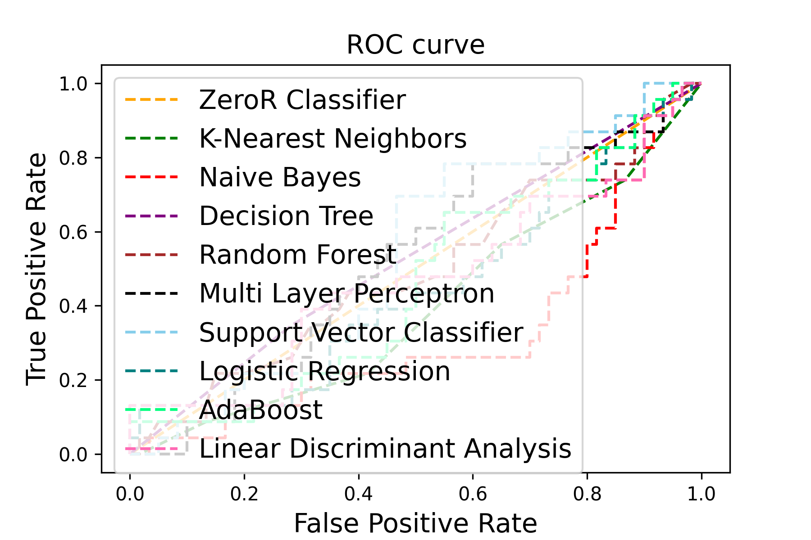

# Liver-Cirrhosis-Detection

This project aims to predict the different stages of liver cirrhosis. It is a supervised learning problem of multi-class classification. 


Run this project in Google Colab.

<a target="_blank" href="https://colab.research.google.com/github/https://colab.research.google.com/drive/1SPGflw2zxkKzVcB_GK75khHFiwYczD4O?usp=sharing">
  
</a>

### Algorithms Explored

The following algorithms have been explored in code:

1. ZeroR Classifier
2. K-Nearest Neighbors  Classifier
3. Naive Bayes Classifier
4. Decision Tree Classifier
5. Random Forest Classifier
6. Multi Layer Perceptron Classifier
7. Support Vector Classifier
8. Logistic Regression Classifier
9. AdaBoost Classifier
10. Linear Discriminant Analysis Classifier

# Dataset

There are a total of 418 PBC cases in the dataset.
```
https://www.kaggle.com/datasets/fedesoriano/cirrhosis-prediction-dataset
```

# Dataset Visualization 


# Corelation 


# Results 

## Accuracy




# Analysis

Linear Analysis


K-th Nearest Neighbors


## Contributing

1. Fork the repository.
2. Create a new branch for your feature using `git checkout -b feature/your-feature-name`.
3. Make your changes and commit them using `git commit -m "Add your commit message here"`.
4. Push your changes to your fork using `git push origin feature/your-feature-name`.
5. Open a pull request to the main repository.

## Credits

This project was created by [KaziRamisaRifa](https://github.com/kaziramisarifa). An Standalone Machine Learning Project From Scratch.
